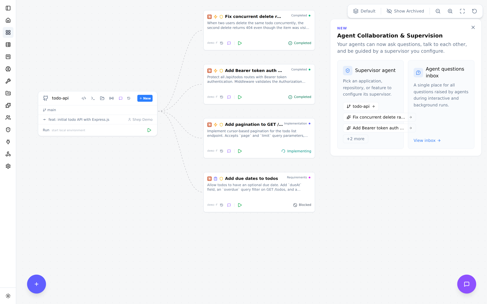

<div align="center">

<picture>
  <source media="(prefers-color-scheme: dark)" srcset="docs/screenshots/shep-logo-dark.png">
  <source media="(prefers-color-scheme: light)" srcset="docs/screenshots/shep-logo-light.png">
  
</picture>

### Run a fleet of coding agents. Merge real PRs.

[](https://github.com/shep-ai/shep/actions/workflows/ci.yml)
[](https://www.npmjs.com/package/@shepai/cli)
[](https://opensource.org/licenses/MIT)
[](https://discord.gg/ES6tdVFfur)


</div>

Shep is the open-source orchestrator for the autonomous development cycle. It runs parallel AI agents — Claude Code, Cursor CLI, Gemini CLI, or any agent CLI — each in its own isolated git worktree, and drives every feature from a one-line description through optional spec gates, implementation, commit, push, CI watching with auto-fix, and a draft pull request. Agent-agnostic, local-first, MIT-licensed.

## Quickstart

```bash
npx @shepai/cli        # try it instantly — opens the dashboard at localhost:4050
npm i -g @shepai/cli   # or install globally
```

Three commands from zero to an open pull request:

```bash
npm i -g @shepai/cli
cd ~/projects/my-app
shep feat new "add a /health endpoint that returns uptime and version" --push --pr
```

Shep creates a worktree, runs your agent, commits, pushes, and opens a PR. Requires Node.js 22+, Git, the GitHub CLI (`gh`), and an authenticated agent CLI (`claude`, `cursor`, or `gemini`). Prefer zero install? [app.shep.bot](https://app.shep.bot) runs Shep in your browser, free.

Then go parallel:

```bash
shep feat new "add stripe payments" --push --pr
shep feat new "add dark mode toggle" --push --pr
shep feat new "fix login redirect bug" --push --pr
```

Three agents, three worktrees, zero branch conflicts — monitored from one place. One agent session is fine; five is chaos. Shep is the part that keeps it from being chaos.

## How it works

```
 idea                optional spec gates       parallel agents           shep automates            you
 "add payments"  →   requirements · plan   →   each in its own       →   commit · push · PR    →   review the diff,
                     (YAML you approve)        git worktree              CI watch + auto-fix       hold the merge button
```

The default flow is prompt → implement → commit → push → PR. Your working directory is never touched: every feature lives in its own worktree on its own branch. If CI fails, the agent reads the logs and pushes a fix (3 retries by default, configurable). For complex features, add `--no-fast` to enable the full spec-driven pipeline — requirements, research, and a plan as versioned YAML artifacts, with approval gates before any code is written. See the [spec-driven development guide](./docs/development/spec-driven-workflow.md).

## Supported agents

| Agent | Support |
|-------|---------|
| Claude Code | Built-in |
| Cursor CLI | Built-in |
| Gemini CLI | Built-in |
| Any terminal agent CLI | Via the generic executor — if it runs in a terminal, Shep can orchestrate it |

Swap agents per feature, per repo, anytime. No lock-in at the tool layer or the model layer.

## Web control center

<picture>
  <source media="(prefers-color-scheme: dark)" srcset="docs/screenshots/control-center-dark.png">
  <source media="(prefers-color-scheme: light)" srcset="docs/screenshots/control-center-light.png">
  
</picture>

A live graph of every repo and feature at `localhost:4050` — real-time status, diff review, interactive chat, one-click open in your IDE. Everything the dashboard does, the CLI does too.

## Configuration and reference

<details>
<summary><strong>Configuration</strong> — per-feature flags and global defaults</summary>

| Flag | What it does | Default |
|------|-------------|---------|
| `--push` | Auto-push after implementation | off |
| `--pr` | Auto-create PR after push | off |
| `--fast` | Skip spec-driven phases, go straight to coding | on |
| `--allow-merge` | Auto-merge the PR after CI passes | off |
| `--allow-prd` / `--allow-plan` | Auto-approve individual spec gates | off |
| `--allow-all` | Enable all automations | off |
| `--model` | Choose which AI model to use | agent default |
| `--repo` | Target a specific repository | current repo |
| `--attach` | Attach reference files for context | — |

Set defaults once with `shep settings workflow` so you stop repeating flags. `shep settings agent`, `shep settings model`, and `shep settings ide` configure the rest.

</details>

<details>
<summary><strong>CLI reference</strong> — core commands</summary>

```
shep                              Start daemon + onboarding (first run)
shep feat new <description>       Create a new feature
shep feat ls                      List features
shep feat show <id>               Show feature details
shep feat resume <id>             Resume a paused feature
shep feat approve <id>            Approve current phase (spec-driven mode)
shep feat reject <id> --feedback  Reject with feedback (spec-driven mode)
shep feat logs <id>               View feature logs
shep agent ls                     List agent runs
shep agent stop <id>              Stop a running agent immediately
shep agent logs <id>              View agent logs
shep repo ls                      List repositories
shep start [--port]               Start web daemon (default: 4050)
shep stop                         Stop the daemon
shep status                       Show daemon status and metrics
shep settings                     Launch setup wizard
```

Full reference: [docs/cli/architecture.md](./docs/cli/architecture.md)

</details>

<details>
<summary><strong>Trust and safety</strong> — what runs where, and what protects you</summary>

Shep runs entirely on your machine. All data lives in `~/.shep/` as SQLite; your code is sent only to whichever agent you configure, under that agent's own terms. Nothing is sent to Shep servers — there are none.

| Concern | How Shep handles it |
|---------|---------------------|
| Git isolation | Every feature runs in its own worktree branched from main. Your working directory is never modified. |
| Agent mistakes | Output lands as a draft PR. Your CI, linters, and security scanners run before any merge. |
| Review before merge | No code merges without your approval unless you explicitly pass `--allow-merge`. |
| Credentials | Shep never reads, stores, or transmits your API keys. |
| Audit trail | Every action and state transition is logged — `shep feat logs <id>`. |
| Emergency stop | `shep agent stop <id>` or the dashboard stop button. The worktree is preserved. |

**Agent permissions:** Shep runs your agent non-interactively, so by default it passes permission-bypass flags (e.g. `--dangerously-skip-permissions` for Claude Code — each agent has an equivalent). Your safety net is three layers deep: worktree isolation, draft PRs, and your CI pipeline. The bypass flag is a default, not a requirement — configure your agent's permission model independently for tighter control. Note that some agents sandbox network access by default; if `npm install` fails inside a feature, allow the hosts in your agent's settings.

**What Shep does not protect you from:** if your CI doesn't catch a vulnerability, Shep won't either. Shep is an orchestration layer, not a security scanner.

</details>

<details>
<summary><strong>FAQ</strong></summary>

**How is this different from using an AI coding agent directly?**
Your agent writes the code. Shep manages everything around it: worktrees, commits, pushes, PRs, CI watching, retries. The difference is most obvious at 3-5 features in parallel.

**What happens if the agent writes bad code?**
Shep opens a draft PR and your CI runs. If tests fail, the agent reads the logs and attempts a fix (up to 3 retries, configurable), then pauses and notifies you. Shep never merges code that fails CI.

**What happens when an agent gets stuck?**
The feature enters a `Blocked` state. You get notified and can provide feedback, restart from a checkpoint, or take over — the code is a standard git worktree on a named branch, open it in your IDE at any point.

**Does this work on large codebases?**
Yes. The practical limit is your agent's context window, not Shep. For monorepos, scope features with `--repo`.

**Can I use this on a team?**
Shep runs locally per developer. Features are just branches and PRs — your existing review process applies.

**Is my code sent anywhere?**
Not by Shep. It goes only to the agent you configure, under that agent's privacy terms. Shep stores everything locally.

**Not in a git repo yet?**
Shep initializes one for you — `git init`, a branch, and off it goes.

</details>

<details>
<summary><strong>Architecture</strong> — for contributors and the curious</summary>

Clean Architecture, four layers:

| Layer | Responsibility |
|-------|---------------|
| Domain | Business logic, TypeSpec-generated types |
| Application | Use cases, port interfaces |
| Infrastructure | SQLite, LangGraph agents, DI |
| Presentation | CLI, Web UI |

[10-minute architecture tour](./ARCHITECTURE.md) · [Full architecture docs](./docs/architecture/overview.md)

</details>

## Community

Shep is open source and AI-native — one of its native abilities is helping itself onboard contributors. Clone, run `pnpm dev:cli doctor`, pick a good first issue, and ship a PR in under 30 minutes.

- [Contributing guide](./CONTRIBUTING.md) — humans start here ([CONTRIBUTING-AGENTS.md](./CONTRIBUTING-AGENTS.md) for AI agents)
- [Good first issues](./GOOD_FIRST_ISSUES.md) — groomed, scoped, ready to pick up
- [Roadmap](./ROADMAP.md) — where Shep is going
- [Architecture](./ARCHITECTURE.md) — how the codebase fits together
- [Discord](https://discord.gg/ES6tdVFfur) — questions, feedback, show and tell

## License

MIT — see [LICENSE](./LICENSE).
