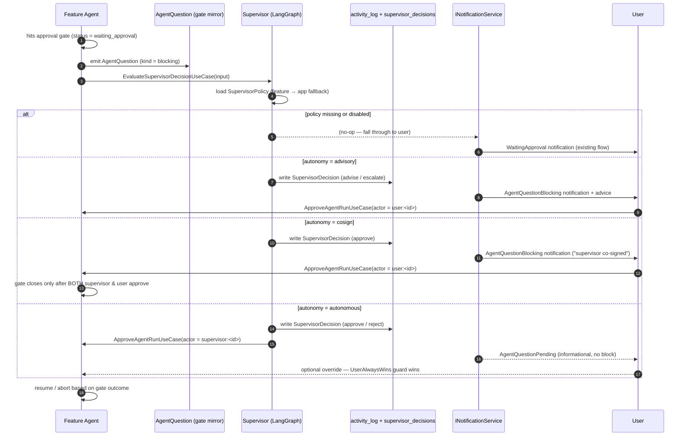

# Agent Collaboration & Supervision

> Spec: [`specs/093-agent-collaboration-supervision/`](../../specs/093-agent-collaboration-supervision/)
> — see `feature.yaml`, [`research.yaml`](../../specs/093-agent-collaboration-supervision/research.yaml),
> and [`plan.yaml`](../../specs/093-agent-collaboration-supervision/plan.yaml).

This document describes the **collaboration & supervision fabric** that lets
Shep agents talk to each other while they work, lets a delegated **supervisor
agent** monitor and intervene on the user's behalf, and surfaces every agent
question (interactive or background) in a single unified inbox.

The whole surface is gated behind the `collaboration` feature flag.
With the flag off, behavior is byte-identical to a vanilla Shep install.

---

## Three capabilities, one fabric

The user question that motivated this feature was simple:

1. *Can agents talk to each other while they work?*
2. *Can I place a supervisor agent on my behalf?*
3. *What happens when agents want to ask questions?*

These map onto three intertwined capabilities sharing one infrastructure:

| Capability | Domain entity | Port | Storage |
|---|---|---|---|
| Agent-to-agent messaging | `AgentMessage` | `IAgentMessageBus` | `agent_messages` |
| Unified question pipeline | `AgentQuestion` | `IAgentQuestionService` | `agent_questions` |
| Delegated supervisor agent | `SupervisorPolicy`, `SupervisorDecision` | `ISupervisorAgent` | `supervisor_policies`, `supervisor_decisions` |

All three follow Shep's standard pipeline: TypeSpec model → SQLite migration →
repository → application port → use case → infrastructure adapter → SSE event
kind → CLI + Web surface.

---

## Topology — hub-and-spoke

Inter-agent traffic is **hub-and-spoke**, not peer-to-peer. The bus rejects
peer addressing in v1; messages target one of:

- `broadcast` (per app/feature)
- `supervisor`
- `user`
- a specific `agentRunId` only as a reply (matched via `correlationId`)

When a `SupervisorPolicy` exists for the app/feature scope, the supervisor
evaluates routed messages and may emit follow-on decisions. When no policy is
configured, a `NullSupervisor` records the message in `activity_log` but
performs no policy evaluation.

This matches the [team-execution
protocol](../../specs/014-ui-sidebar/team-execution.md) draft (the EM hub) and
keeps audit centralized. Reply round-trips are direct via `correlationId` so
high-frequency exchanges don't bottleneck on the hub.

```
       ┌──────────┐         ┌──────────┐         ┌──────────┐
       │ Agent A  │         │ Agent B  │         │ Agent C  │
       │ (run-1)  │         │ (run-2)  │         │ (run-3)  │
       └────┬─────┘         └────┬─────┘         └────┬─────┘
            │                    │                    │
            │   publish/listen   │   publish/listen   │
            └──────────┬─────────┴──────────┬─────────┘
                       │                    │
                       ▼                    ▼
              ┌─────────────────────────────────────┐
              │  IAgentMessageBus (SQLite-backed)   │
              │  agent_messages table, WAL, polled  │
              └────────────────┬────────────────────┘
                               │
                  ┌────────────┴────────────┐
                  ▼                         ▼
          ┌────────────────┐       ┌─────────────────┐
          │ ISupervisorAgent│       │ SSE event stream│
          │  (policy hub)   │       │  (UI / CLI)     │
          └────────────────┘       └─────────────────┘
```

The **bus is cross-process by virtue of shared SQLite** — every worktree
process opens the same `~/.shep/<repo-hash>/shep.db` in WAL mode, so two
parallel feature agents in different worktrees coordinate by reading and
writing `agent_messages` without any new IPC primitive.

---

## Autonomy ladder

Every `SupervisorPolicy` carries an `autonomyLevel` that controls how much
authority the supervisor exercises:

| Level | Supervisor can | User must |
|---|---|---|
| `advisory` *(default)* | recommend (`advise` / `escalate`) | always act on every gate |
| `cosign` | recommend or pre-approve (`approve` / `reject`) | also approve before the gate passes |
| `autonomous` | close the gate directly (`approve` / `reject`) via the existing approve/reject use cases | nothing (but can override at any time) |

`autonomyLevel` is the per-policy default. Per-gate overrides live in
`gateAuthorityJson` (`prd` / `plan` / `merge` → autonomy override) so a user
can run the supervisor in `advisory` mode for PRD review but `autonomous` for
merges, all in the same policy.

`advisory` is the default for a brand-new install, because promoting the
supervisor to autonomous-by-default would silently change the trust contract
that today's approval gates establish.

### "User always wins" invariant

When the supervisor and the user disagree on a gate, **the user's decision is
final.** The supervisor's vote is recorded for audit but cannot override.

The invariant is enforced inside `ApproveAgentRunUseCase` and
`RejectAgentRunUseCase`: when the actor namespace is `supervisor:<id>`, the use
case looks up any prior user decision on the same gate; if one exists, the
supervisor's call is rejected with the rationale stored in the decision row.

This pattern keeps the existing `waiting_approval` state machine as the
**single source of truth** — the supervisor acts AS an actor inside it, not
alongside it. No new pause primitive was invented.

---

## Approval-gate flow with a supervisor



Key properties:

- **One state machine.** Every path resolves through the existing
  `waiting_approval` → `Approve` / `Reject` flow. The supervisor is just a new
  actor namespace.
- **Failure is fail-safe.** A timeout / model error / exception inside the
  supervisor MUST NOT block the agent. The graph publishes a
  `SupervisorDecision { verdict: 'escalate' }` and a `SupervisorFailed`
  notification — the human path proceeds immediately (FR-22).
- **Override is always reversible.** The user can call
  `RejectAgentRunUseCase(actor = user:<id>)` at any point; the prior-user-
  decision guard then refuses any subsequent supervisor action on the same
  gate.

---

## Unified question pipeline

`AgentQuestion` is the single surface for **every** agent-to-human ask, no
matter which execution mode raised it.

Two write paths converge here:

1. **Interactive sessions.** The Claude Code SDK V2 `canUseTool` interception
   in
   [`claude-code-interactive-executor.service.ts`](../../packages/core/src/infrastructure/services/agents/common/executors/claude-code-interactive-executor.service.ts)
   already excludes `AskUserQuestion` from auto-allowed tools, so every
   invocation hits the callback. The callback now calls
   `AskAgentQuestionUseCase` and awaits a `Deferred` registered in an
   in-process `DeferredQuestionRegistry`. When `AnswerAgentQuestionUseCase`
   resolves the row, the registry resolves the Promise and the SDK callback
   returns to the agent.
2. **Background feature agents.** Whenever
   [`feature-agent-worker.ts`](../../packages/core/src/infrastructure/services/agents/feature-agent/feature-agent-worker.ts)
   transitions a run to `waiting_approval`, it emits a parallel
   `AgentQuestion` of `kind = blocking` so the same gate appears in the
   unified inbox alongside interactive questions.

Both paths converge on `AnswerAgentQuestionUseCase`:

- Interactive mode → resolve the in-process `Deferred` so the SDK callback
  returns.
- Background mode → forward to `ApproveAgentRunUseCase` /
  `RejectAgentRunUseCase` with the appropriate actor.

### Three urgency tiers

Every `AgentQuestion` has a `kind`:

| Kind | UX |
|---|---|
| `info` | streams to the per-feature activity feed only — no notification |
| `question` | queued in the inbox; notification fires at user-controlled urgency; agent may auto-resolve to `defaultAnswer` after `expiresAt` |
| `blocking` | always raises a notification within ≤ 2s (NFR-10); the agent is paused until answered or cancelled |

The three tiers map cleanly onto the spec-014 vocabulary
(`[TASK-READY]`/`[BLOCKED]`/`[USER-UPDATE]`).

---

## Audit & explainability

Delegated authority without explainability is the fastest way to lose user
trust, so **every supervisor decision stores a full rationale.**

A `SupervisorDecision` row carries:

- `verdict` — `approve` | `reject` | `escalate` | `advise`
- `rationaleText` — free-form prose written by the evaluator
- `modelId` — the LLM the evaluator ran on (e.g. `claude-sonnet-4`)
- `promptVersion` — version stamp on the evaluator prompt
- `ruleRef` *(optional)* — the policy rule that fired
- `confidence` *(optional)* — 0–1 self-reported confidence
- `sourceEventKind` / `sourceEventId` — what triggered the evaluation
- `supervisorRunId` — the supervisor's own `agent_runs` row

Each row is **mirrored into `activity_log`** (the immutable audit table from
migration 064) with `actor_id = "supervisor:<id>"`, so the supervisor's
decisions appear next to user actions in the same chronological feed and can
never be silently rewritten.

In the web UI, the **"Why?"** drawer
([`supervisor-decision-why-drawer.tsx`](../../src/presentation/web/components/supervisor/supervisor-decision-why-drawer.tsx))
opens on every gate or question that has a decision attached. It renders the
full chronological audit (verdict + rationale + model/prompt versions) so the
user can inspect why the supervisor did what it did, even months later after
the model has rotated.

---

## Configuration scope

`SupervisorPolicy` is keyed by `(appId, featureId NULLABLE)` and resolves
**feature-first, then app-fallback**. A user can:

- set a default policy at the app level (`/application/<id>/supervisor`), and
- override it for a specific feature
  (`/application/<id>/supervisor?feature=<featureId>`).

This matches every existing scoping decision in Shep (Settings, ApprovalGates,
AgentDefinition all cascade app → feature) so there is one mental model for
all configuration.

The CLI has parity with web:

- `shep supervisor configure` — write/update a policy
- `shep supervisor enable` / `shep supervisor disable` — flip the toggle
- `shep supervisor status` — show resolved policy
- `shep supervisor approve` / `shep supervisor reject` — drive a gate from a
  scripted/cron context

The web surface lives at:

- `/application/[id]/supervisor` — config form (autonomy, model, prompt
  version, per-gate authority)
- `/agent-questions` — unified inbox across all apps
- per-feature **Agent Activity** panel — message timeline + inline "Why?"
  affordance on supervisor decisions

Both consume the **same use cases** (`ConfigureSupervisorUseCase`,
`GetSupervisorPolicyUseCase`, `ListAgentQuestionsUseCase`,
`AnswerAgentQuestionUseCase`, etc.). No business logic lives in CLI or Web —
they are thin adapters over the use-case API, per
[`.claude/rules/code-quality.md`](../../.claude/rules/code-quality.md).

---

## Notification routing

Supervisor escalations and pending questions reach the user through the
existing `INotificationService`. The collaboration fabric adds five new
`NotificationEventType` values (defined in
[`tsp/common/enums/notification.tsp`](../../tsp/common/enums/notification.tsp)):

- `agent_question_pending`
- `agent_question_blocking`
- `agent_message_blocked`
- `supervisor_escalated`
- `supervisor_failed`

Each kind is exposed as a boolean in `Settings.notifications.events`, so users
can mute any of them per channel (in-app / desktop / browser). No parallel
delivery channel was built — the existing notification surface is the single
mental model for every agent-driven alert.

---

## SSE event extensions

Three new event kinds are streamed through the existing
`StreamAgentEventsUseCase` (default 2s poll, opt-in 500ms for
blocking-priority subscriptions):

- `agent_message`
- `agent_question`
- `supervisor_decision`

Each is computed by a dedicated helper (`computeMessageDeltas`,
`computeQuestionDeltas`, `computeDecisionDeltas`) that mirrors the existing
`computeFeatureDeltas` / `computePrDeltas` / `computeStatusDeltas` shape, so
the web Service Worker fans them out to every tab through the same multiplex
without any transport changes.

---

## Feature flag

The whole surface lives behind `FeatureFlags.collaboration`:

- TypeSpec field on `FeatureFlags` in
  [`tsp/domain/entities/settings.tsp`](../../tsp/domain/entities/settings.tsp).
- SQLite column `feature_flag_collaboration` on `settings`
  (migration 091).
- Env override `NEXT_PUBLIC_FLAG_COLLABORATION` (DB-primary; env is fallback).

With the flag **off**:

- New use cases short-circuit at their entry guards (return
  `{ enabled: false }`).
- New web routes return 404.
- New CLI subcommands print "feature is disabled".
- No new SSE event kinds are emitted.
- No new tables are written.
- Notification preferences default to *off* for the new event kinds.

This satisfies NFR-14 — byte-identical default behavior.

---

## Where to look in code

| Layer | Path |
|---|---|
| TypeSpec models | `tsp/agents/agent-message.tsp`, `agent-question.tsp`, `supervisor-policy.tsp`, `supervisor-decision.tsp` |
| Generated types | `packages/core/src/domain/generated/output.ts` |
| Value objects | `packages/core/src/domain/value-objects/supervisor-actor.ts` |
| Output ports | `packages/core/src/application/ports/output/agents/` (`agent-message-bus`, `agent-question-service`, `supervisor-agent`) |
| Repository ports | `packages/core/src/application/ports/output/repositories/` (`agent-message-repository`, `agent-question-repository`, `supervisor-policy-repository`, `supervisor-decision-repository`) |
| Use cases | `packages/core/src/application/use-cases/agents/` (`send-agent-message`, `ask-agent-question`, `answer-agent-question`, `cancel-agent-question`, `list-agent-questions`, `escalate-to-user`, `configure-supervisor`, `enable-supervisor`, `disable-supervisor`, `get-supervisor-policy`, `evaluate-supervisor-decision`) |
| SSE deltas | `packages/core/src/application/use-cases/agents/stream-agent-events/compute-{message,question,decision}-deltas.ts` |
| Supervisor agent | `packages/core/src/infrastructure/services/agents/supervisor-agent/` (`supervisor-graph.ts`, `supervisor-agent-worker.ts`, `evaluator-prompt.ts`, `stub-supervisor-executor.ts`) |
| Approval-gate hooks | `packages/core/src/application/use-cases/agents/approve-agent-run.use-case.ts`, `reject-agent-run.use-case.ts` |
| SQLite migrations | `087-create-agent-messages.ts`, `088-create-agent-questions.ts`, `089-create-supervisor-policies.ts`, `090-create-supervisor-decisions.ts`, `091-add-feature-flag-collaboration.ts` |
| CLI commands | `src/presentation/cli/commands/supervisor/`, `src/presentation/cli/commands/agent/{message,questions}/` |
| Web routes | `src/presentation/web/app/application/[id]/supervisor/page.tsx`, `src/presentation/web/app/agent-questions/page.tsx` |
| Web components | `src/presentation/web/components/{supervisor,agent-questions,agent-activity}/` |

---

## Related

- [Agent system architecture](./agent-system.md)
- [AGENTS.md](../../AGENTS.md) — agent resolution rules + supervisor actor
  namespace
- [Spec 014 team-execution protocol](../../specs/014-ui-sidebar/team-execution.md)
- [Clean Architecture](./clean-architecture.md)
