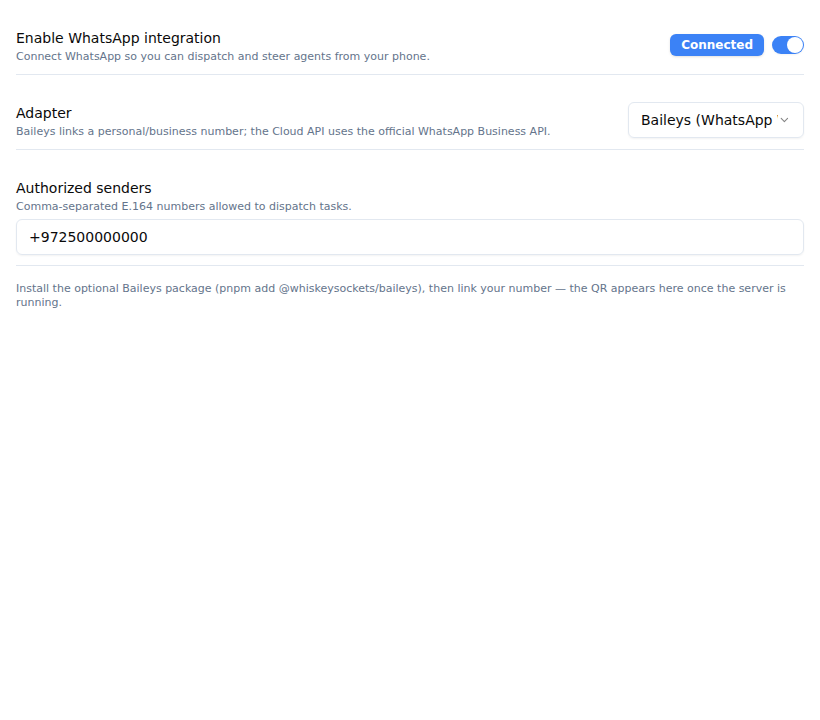
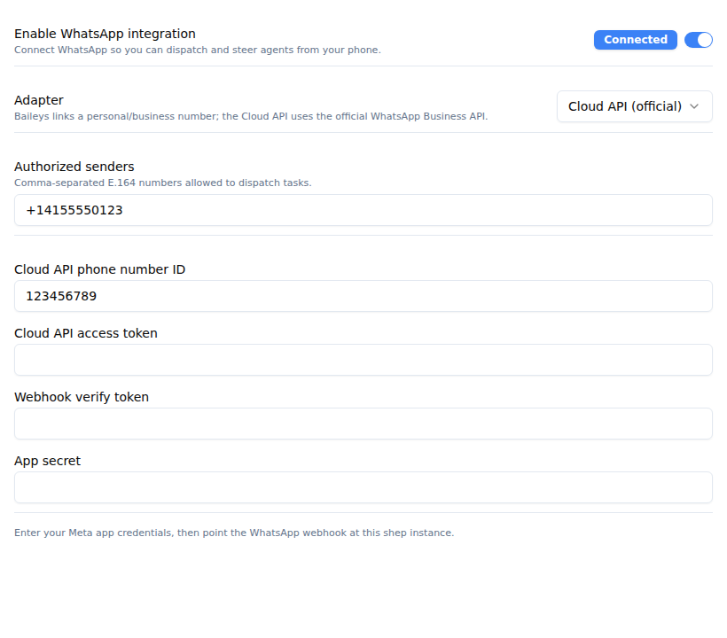

# WhatsApp Task Dispatch (spec 101)

Run shep's idea-to-deploy loop from a WhatsApp thread — built for mobile-first,
Hebrew-speaking solo founders and small teams. Send a message to start work,
receive agent updates, and steer the agent by replying in the chat.

> Status: shipped. Core engine, both adapters, connection service, outbound
> lifecycle notifications, web Settings UI (adapter picker + status badge), the
> Cloud API webhook route, the `shep whatsapp status` command, and feature-bound
> HITL approve/reject routing are all in. The one remaining future capability
> (tracked in `specs/101-whatsapp-task-dispatch`) is a way to BIND an existing
> feature to a WhatsApp thread — today dispatch creates Application bindings, so
> the feature-HITL path is implemented/tested but reachable only once such a
> binding exists.

## Settings UI

The WhatsApp section appears in **Settings → WhatsApp** once the
`whatsappDispatch` feature flag is on.

| Baileys (default), connected | Cloud API selected |
| --- | --- |
|  |  |

Switching the adapter to **Cloud API** reveals the Meta Graph credential fields
(phone number ID, access token, verify token, app secret). The connection-status
badge reflects the live adapter state (Connected / Scan QR / Error).

## How it works

```
WhatsApp ──inbound──▶ Gateway adapter (Baileys | Cloud API)
                         │
                         ▼
              WhatsAppConnectionService  ──── thread mapping (SQLite)
                         │ no business logic
          ┌──────────────┴───────────────┐
          ▼                              ▼
 DispatchWhatsAppMessageUseCase   RouteWhatsAppReplyUseCase
 (new thread → create app          (bound thread → forward into the
  session + map thread)             live interactive session)
          │                              │
          ▼                              ▼
   CreateApplicationUseCase     SendInteractiveMessageUseCase
```

- **Provider-agnostic.** Everything is wired behind the `IWhatsAppGateway` port.
  Two adapters implement it and are selectable in Settings:
  - **Baileys (default)** — unofficial WhatsApp Web. Links a personal/business
    number via QR / pairing code. No Meta approval, mobile-first. **Violates
    WhatsApp's ToS — your number can be banned.**
  - **Cloud API** — official WhatsApp Business Cloud API. Ban-safe; requires a
    Meta Business account and the Cloud API credentials.
- **Authorization is explicit.** Only numbers listed in
  `Settings.whatsapp.allowedNumbers` may dispatch. Unknown senders are ignored
  with a localized "not linked" reply.
- **Localized, Hebrew-first.** Outbound text is rendered per the user's
  `preferredLanguage`, falling back to English.

## Enabling

1. Turn on the **WhatsApp Task Dispatch** feature flag (Settings → Feature
   Flags), then enable the integration and pick an adapter
   (Settings → WhatsApp).
2. Add your phone number(s) to the authorized senders list.
3. **Baileys:** install the optional package, then link your number:
   ```bash
   pnpm add @whiskeysockets/baileys
   ```
   The connection service starts with the web server (`shep ui`). Linking (QR /
   pairing) is surfaced in the web Settings UI.
   **Cloud API:** set the phone number id, access token, verify token, and app
   secret from your Meta app; point the webhook at shep's Cloud API route.
4. Check configuration from the terminal:
   ```bash
   shep whatsapp status
   ```

## Why Baileys is optional

Baileys pulls a large, partly-native dependency tree that is sensitive to
bundling (Next.js / Storybook / Electron) and currently ships a release
candidate as `latest`. shep loads it lazily via a dynamic import, so it is **not
installed by default** and the rest of shep builds and runs without it. If you
prefer a ban-safe, production path, use the Cloud API adapter — it needs no
extra dependency.

## Architecture notes

- Domain enums (`WhatsAppAdapterKind`, `WhatsAppConnectionStatus`,
  `WhatsAppThreadTargetKind`) and `WhatsAppConfig` are TypeSpec-defined.
- Ports: `IWhatsAppGateway`, `IWhatsAppThreadMappingRepository`.
- The connection service follows the `NotificationWatcherService` lifecycle
  (`start` / `stop` / `isRunning`) and is bootstrapped in `shep ui` / `_serve`.
- All decisions live in use cases; adapters and the connection service only
  transport bytes and select the adapter.
